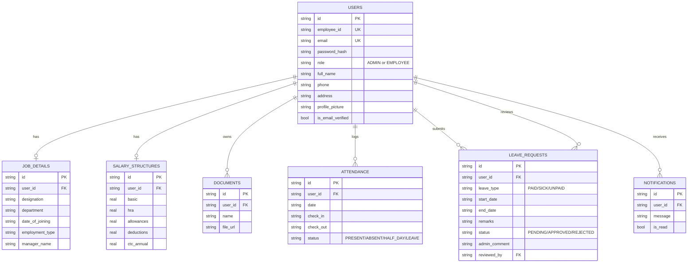

# Entity–Relationship Diagram

## Relationship notes

- `users.role` distinguishes **Admin/HR Officer** from **Employee** — the same table backs both, per the requirements doc's user-class definitions.
- `job_details` and `salary_structures` are 1:1 with `users`, created automatically at signup so every account has an editable (initially empty) job/salary record from day one.
- `documents` is 1:many — an employee can have multiple files on record.
- `attendance` has a unique constraint on `(user_id, date)` — one record per employee per day, updated in place by check-in/check-out.
- `leave_requests.reviewed_by` references the admin user who approved/rejected the request, distinct from `user_id` (the requester).
- Approving a leave request writes/updates matching rows in `attendance` for each day in the leave's date range, keeping the two in sync as described in section 3.5.2 of the requirements ("changes reflect immediately in employee records").
